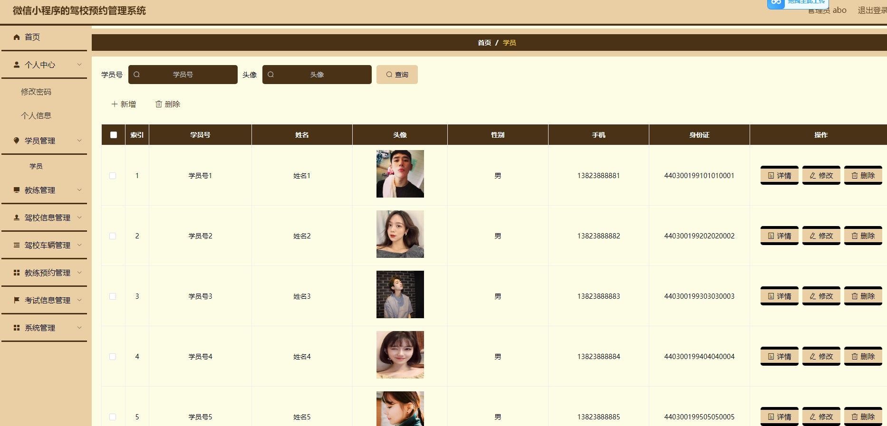
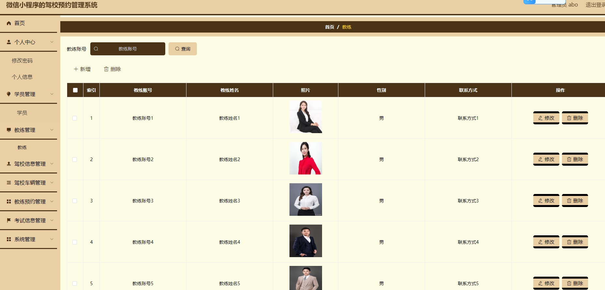
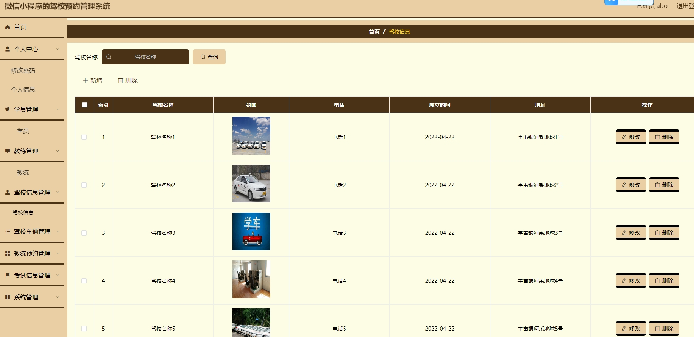
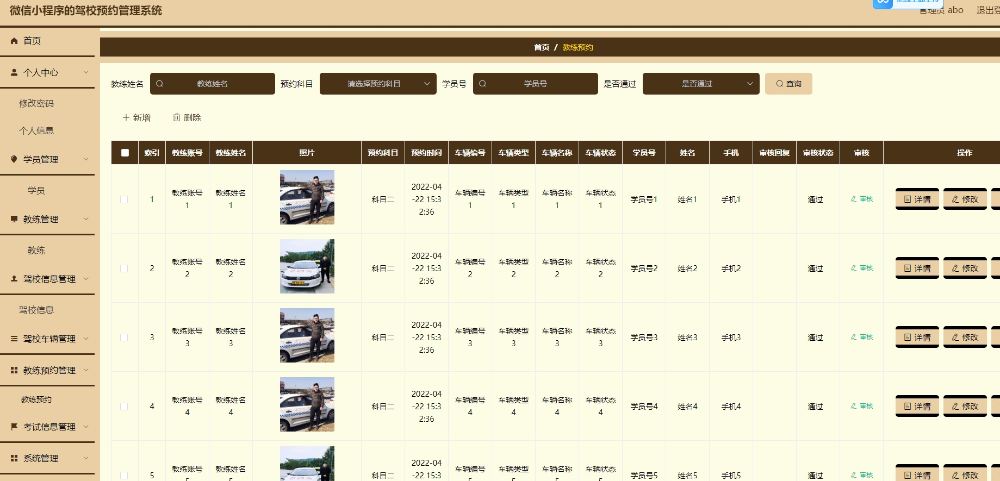
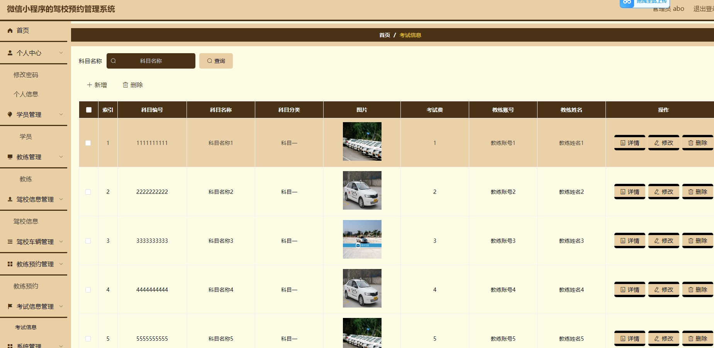
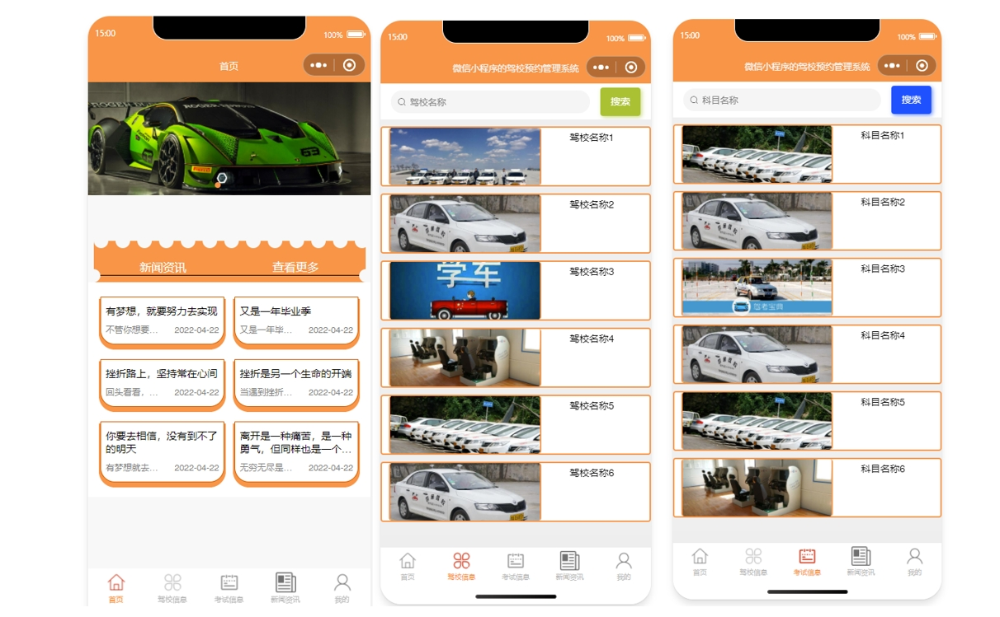
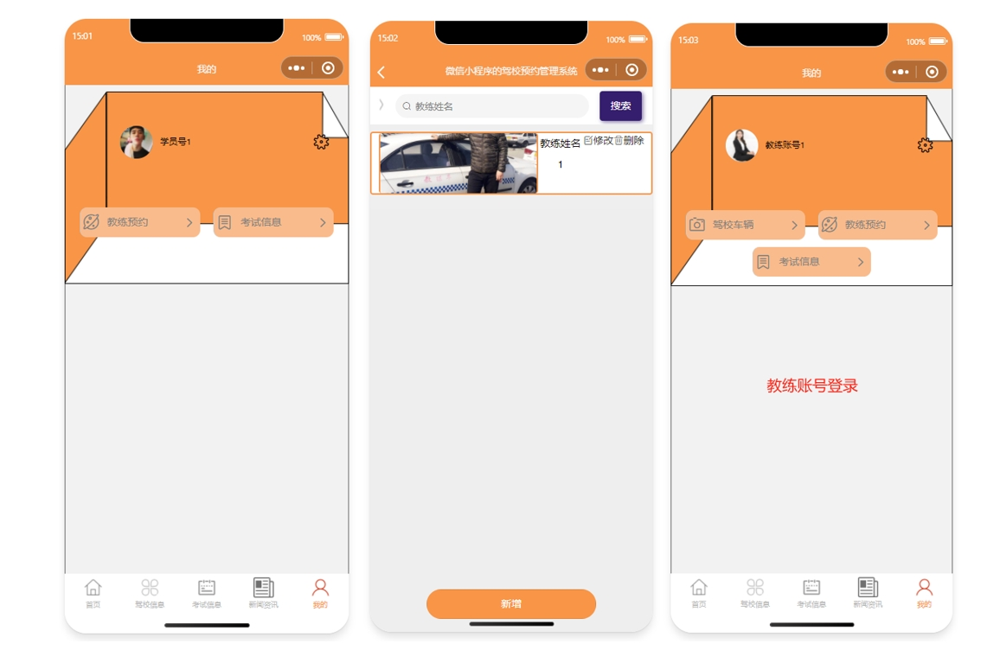
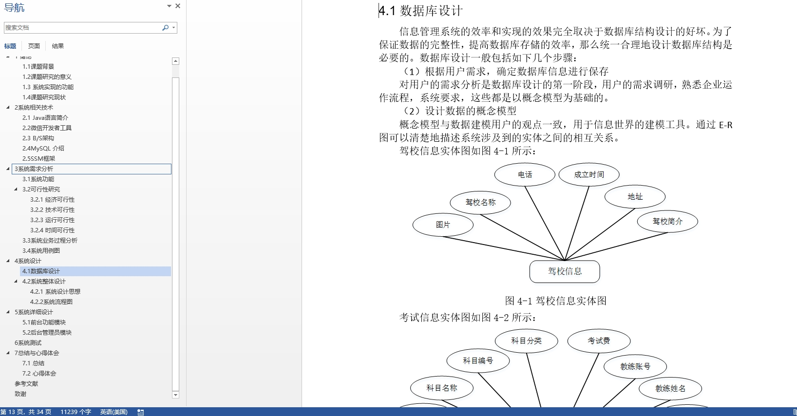

# 1.项目介绍
- 系统角色：管理员、学员、教练
- 功能模块：学员管理、教练管理、驾校信息管理、驾校车辆管理、教练预约管理、考试信息管理等
- 技术选型：SSM，Vue（后端管理web），uniapp等
- 测试环境：idea2024，jdk1.8，mysql5.7，maven3，tomcat8，HbuilderX，微信开发工具
# 2.项目部署
## 2.1 后端部署
- 创建数据库，导入sql文件
- idea打开项目，根据本地数据库环境修改 src/main/resources/config.properties  3-5行 （如果你本地数据库是8.0的，注意替换pom里依赖的版本、以及第三行配置serverTimezone，这都是基础，百度遍地都是。）
- 配置tomcat，启动项目，其中，我将deployment下的application contex配置为 /ssmsgh0r
- http://localhost:8080/ssmsgh0r/admin/dist/index.html   管理员账号密码：abo/abo， 其他自行查表
- 说明：vue项目是src/main/webapp/admin，上面的链接是直接运行了编译后的文件，如果你要对页面做一些修改，可以通过vscode或者webstorm去打开vue项目进行修改
## 2.2 小程序部署
- 通过微信开发工具，打开项目mp-weixin
- appid配置为你自己小程序的，或者你自己申请的测试小程序appid
- 信任项目即可，如果页面空白，重新编译下
- 说明：mp-weixin是uniapp项目编译后的，如果你想对小程序做一些修改，你可以通过HbuilderX打开src/main/resources/front，这个是uniapp项目
# 3.项目部分截图

# 4.获取方式
[戳我查看](https://gitee.com/aven999/mall)
